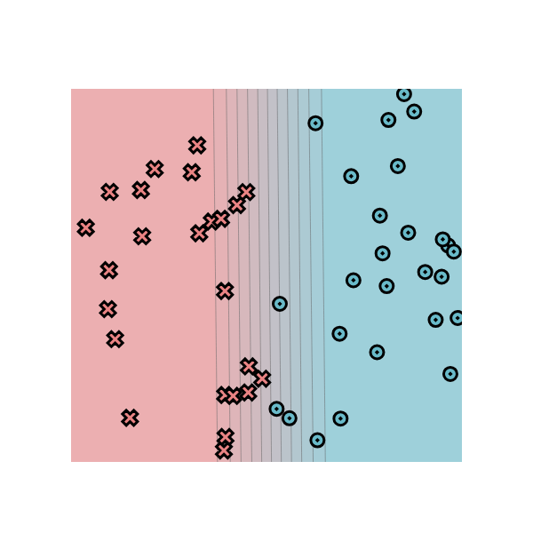

# MiniTorch Module 0

* Docs: https://minitorch.github.io/

* Overview: https://minitorch.github.io/module0/module0/

  
- Parameters
  - linear.weight_0_0 == -8.61
    - 影响分割线的集中程度(Variance?越负，蓝色越多)
  - linear.weight_1_0 == -0.09
    - 影响分割线的倾斜角度(越负，越偏向红色)
  - linear.bias_0 == 4.14
    - 影响分割线的左右位置(越负，越靠近左边)